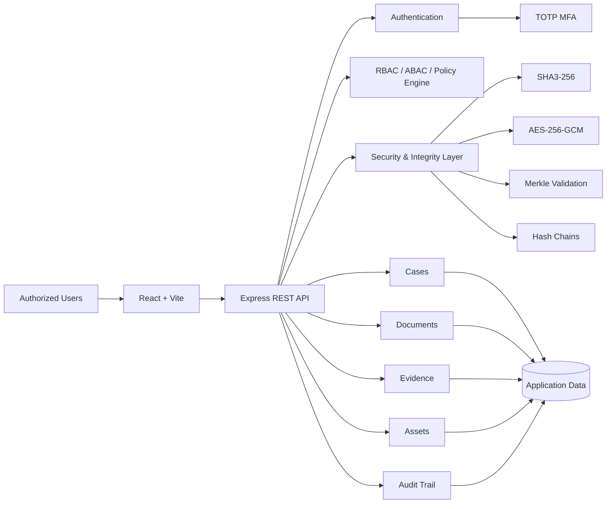
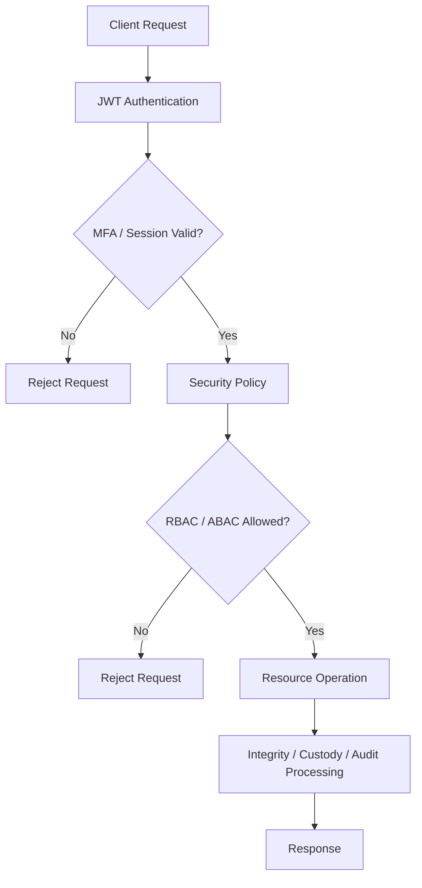

# CaseVault

<div align="center">

**Secure Case, Evidence & Asset Management with Cryptographic Integrity**

A security-first web platform for managing investigation cases, documents, evidence, department assets, and audit records — with server-side authorization, multi-factor authentication, tamper-evident chains, and cryptographic integrity verification.

[](https://react.dev/)
[](https://vite.dev/)
[](https://nodejs.org/)
[](https://expressjs.com/)
[](https://jwt.io/)
[](#security-model)

</div>

---

## Overview

Investigation teams work with sensitive records where **confidentiality, controlled access, traceability, and integrity** are critical.

Traditional file-management systems can store documents, but storage alone does not answer important questions:

- Who is allowed to access a case?
- Has an evidence record been changed?
- Who transferred custody of an item?
- Can an audit trail be trusted?
- Can the system verify that a document is still the same document?
- Can sensitive operations be traced back to a specific action?

**CaseVault addresses these requirements by combining case management with security and integrity controls.**

The platform provides a centralized workflow for:

**Cases → Documents → Evidence → Chain of Custody → Assets → Audit Logs → Integrity Verification**

> CaseVault is a working development prototype. It demonstrates the security architecture and implemented mechanisms described below; production deployments would require hardened infrastructure, managed key storage, persistent production databases, and operational controls.

---

## The Problem

Sensitive investigation data is often distributed across documents, spreadsheets, file systems, and separate tracking processes.

This creates several risks:

1. **Unauthorized access** — users may access information outside their role or clearance.
2. **Record tampering** — changes to documents or evidence records may be difficult to detect.
3. **Broken chain of custody** — evidence movement needs a verifiable history.
4. **Weak auditability** — sensitive actions need an immutable or tamper-evident trail.
5. **Fragmented asset management** — department equipment needs lifecycle tracking.
6. **Client-side-only security** — hiding a UI button is not sufficient authorization.

CaseVault approaches these problems from the backend first: **authentication, authorization, integrity verification, and audit controls are enforced by the API rather than trusted solely to the frontend.**

---

## The Solution

CaseVault provides a single security-focused platform where authorized users can manage investigation data while the backend continuously applies access and integrity controls.

### Core workflow

```text
User
  ↓
Authentication
  ↓
TOTP MFA (when enabled)
  ↓
JWT access
  ↓
Server-side security policy
  ↓
RBAC / ABAC checks
  ↓
Case / Document / Evidence / Asset operation
  ↓
Integrity + audit processing
  ↓
Verified result
```

### What the platform provides

| Capability | Solution |
|---|---|
| Authentication | JWT-based authentication with optional TOTP MFA |
| Authorization | Server-side role and policy checks |
| Case management | Create, view, classify, and manage investigation cases |
| Document protection | Document metadata and cryptographic integrity verification |
| Evidence management | Evidence registration and custody transfers |
| Chain of custody | Hash-linked custody history |
| Asset management | Track department assets through their lifecycle |
| Auditability | Security-sensitive actions recorded in an audit chain |
| Integrity verification | SHA3-256, hash chains, and Merkle validation |
| Data protection | AES-256-GCM encryption helpers |
| Security visibility | Security and verification dashboards |

---

## Key Features

### 🔐 Authentication & MFA

CaseVault uses a multi-step authentication flow:

```text
Login
  ↓
Credentials validated
  ↓
MFA enabled?
  ├── No  → JWT issued
  └── Yes → TOTP verification → JWT issued
```

Implemented components include:

- JWT bearer authentication
- Password hashing
- TOTP-based MFA flow
- Token refresh/logout flow
- Protected API routes
- Authentication middleware

---

### 🛡️ Server-Side Authorization

CaseVault does not rely on frontend route protection alone.

Every protected API operation is evaluated on the server.

The authorization model combines:

- Authentication state
- User role
- Department
- Clearance
- MFA state
- Device trust
- Request risk
- Resource/action being requested

Conceptually:

```text
Request
  ↓
Authenticated?
  ↓
Role allowed?
  ↓
Policy satisfied?
  ↓
Resource access allowed?
  ↓
Execute operation
```

This creates a **zero-trust-style authorization flow** where each sensitive request is evaluated instead of assuming that an authenticated user can access everything.

---

### 🔏 Cryptographic Integrity

CaseVault treats data integrity as a first-class feature.

Implemented cryptographic mechanisms include:

- **AES-256-GCM** for authenticated encryption
- **SHA3-256** for hashing
- **HKDF-style key derivation helper**
- **Hash chains**
- **Merkle tree generation**
- **Merkle proof verification**
- **Custody-chain validation**
- **Audit-chain validation**

The goal is not simply to store a record, but to provide a mechanism for detecting unexpected modification.

---

### 📦 Evidence & Chain of Custody

Evidence records can move between authorized users or stages of an investigation.

Each custody event can reference the previous state through cryptographic hashes:

```text
Evidence Created
      ↓
Custody Event 1
      ↓
Custody Event 2
      ↓
Custody Event 3
      ↓
Current Evidence State
```

Conceptually:

```text
currentHash = H(previousHash + eventData)
```

If historical data is modified, the hash relationship can no longer validate correctly.

CaseVault exposes this verification through the backend and the application UI.

---

### 📋 Tamper-Evident Audit Trail

Security-sensitive operations are represented in an audit chain.

Instead of treating logs as ordinary text records, CaseVault maintains relationships between audit events so that the sequence can be verified.

```text
Event A
  ↓ hash
Event B
  ↓ hash
Event C
  ↓ hash
Event D
```

The verification layer can detect inconsistencies in the expected chain.

> This provides tamper-evident integrity; it should not be described as mathematically immutable storage without additional infrastructure controls.

---

### 🗂️ Case Management

Cases provide the central organizational unit for investigations.

The application supports workflows around:

- Case listing
- Case details
- Case status
- Classification
- Case members
- Associated documents
- Associated evidence
- Investigation-related records

---

### 📄 Document Management

Documents are associated with investigation workflows and can be checked for integrity.

The platform provides:

- Document records
- Document metadata
- Protected API access
- Integrity verification
- Security verification UI

The important distinction is that **document integrity can be verified independently of simply trusting the stored metadata.**

---

### 🧰 Asset Management

CaseVault also manages department assets such as operational equipment.

The asset lifecycle can be represented as:

```text
Available
   ↓
Assigned
   ↓
Maintenance
   ↓
Available
   ↓
Retired
```

This provides a single place to track operational assets alongside investigation workflows.

---

## Architecture



### Security request flow



---

## Technology Stack

| Layer | Technology |
|---|---|
| Frontend | React 18, Vite, React Router |
| State | Redux Toolkit |
| UI | Tailwind CSS, Lucide React |
| Data visualization | Recharts |
| HTTP client | Axios |
| Backend | Node.js, Express |
| Validation | Zod |
| Security middleware | Helmet, CORS, rate limiting |
| Authentication | JWT |
| Password security | Argon2 / bcrypt |
| MFA | otplib / TOTP |
| Encryption | AES-256-GCM |
| Hashing | SHA3-256 |
| Integrity | Hash chains, Merkle trees |
| Logging | Pino |
| Storage hooks | PostgreSQL, Redis, MinIO |
| Testing | Node.js built-in test runner |
| Language | JavaScript / JSX |

---

## Project Structure

```text
CaseVault/
│
├── frontend/
│   ├── src/
│   │   ├── pages/
│   │   ├── components/
│   │   ├── services/
│   │   └── ...
│   ├── package.json
│   └── vite.config.*
│
├── backend/
│   ├── src/
│   │   ├── routes/
│   │   ├── services/
│   │   ├── middleware/
│   │   └── server.js
│   ├── scripts/
│   ├── package.json
│   └── ...
│
├── docs/
│   ├── architecture.md
│   ├── security.md
│   ├── cryptography.md
│   ├── authorization.md
│   └── evidence-chain.md
│
├── .env.example
├── .gitignore
└── README.md
```

---

## Application Modules

| Module | Purpose |
|---|---|
| Dashboard | Security and operational overview |
| Cases | Investigation case management |
| Documents | Document records and integrity checks |
| Evidence | Evidence registration and custody |
| Assets | Department asset lifecycle |
| Audit | Audit events and chain verification |
| Security | Security posture and policy information |
| Verification | Integrity verification workflows |
| Profile | User profile |
| Settings | Application preferences |

---

## API

The backend exposes REST APIs under:

```text
/api/v1
```

### Authentication

```http
POST /api/v1/auth/login
POST /api/v1/auth/verify-mfa
POST /api/v1/auth/refresh
POST /api/v1/auth/logout
GET  /api/v1/auth/me
```

### Cases

```http
GET  /api/v1/cases
POST /api/v1/cases
GET  /api/v1/cases/:id
```

### Other API groups

```text
Documents
Evidence
Assets
Audit
Security
```

Health check:

```http
GET /health
```

A successful API response follows the project's standard response structure:

```json
{
  "success": true,
  "data": {}
}
```

---

## Getting Started

### Prerequisites

Install:

- Node.js LTS
- npm
- Git

### 1. Clone the repository

```bash
git clone https://github.com/gnanadeep30805/CaseVault.git
cd CaseVault
```

### 2. Configure environment variables

Copy the example environment file:

```bash
cp .env.example backend/.env
```

On Windows PowerShell:

```powershell
Copy-Item .env.example backend/.env
```

Review the values in `backend/.env` before running the application.

### 3. Start the backend

```bash
cd backend
npm install
npm start
```

The API runs on:

```text
http://localhost:4000
```

### 4. Start the frontend

Open another terminal:

```bash
cd frontend
npm install
npm run dev
```

The development application is available at:

```text
http://localhost:5173
```

### 5. Run backend tests

```bash
cd backend
npm test
```

---

## Local Development

| Service | Address |
|---|---|
| Web application | http://localhost:5173 |
| Backend API | http://localhost:4000 |
| API health | http://localhost:4000/health |
| API base | http://localhost:4000/api/v1 |

The current prototype is designed to run locally without requiring the full production infrastructure stack.

---

## Security Model

CaseVault follows four major security principles:

### 1. Authenticate every protected session

A user must authenticate before accessing protected resources.

### 2. Authorize on the server

Frontend checks improve user experience but are **not treated as security boundaries**.

The backend evaluates permissions before sensitive operations.

### 3. Verify integrity

Documents, evidence custody events, and audit events can be checked through cryptographic verification mechanisms.

### 4. Keep secrets away from the frontend

Cryptographic and authentication secrets belong in the backend environment and, in production, should be managed by dedicated secret/key-management infrastructure.

---

## Cryptographic Design

### Encryption

CaseVault includes AES-256-GCM support for authenticated encryption.

```text
Plaintext
   ↓
AES-256-GCM
   ↓
Ciphertext + Authentication Tag
```

A unique IV/nonce must be used for each encryption operation.

### Hashing

SHA3-256 is used to produce deterministic integrity digests:

```text
Data
 ↓
SHA3-256
 ↓
Digest
```

### Merkle validation

Multiple records can be represented in a Merkle tree:

```text
             Root
            /    \
          H12    H34
         /  \   /  \
       H1   H2 H3   H4
       │    │  │    │
      R1   R2 R3   R4
```

This allows the system to validate whether a record is consistent with a known Merkle root.

---

## Current Implementation vs Production Roadmap

CaseVault intentionally distinguishes between **implemented prototype functionality** and infrastructure that would be required for a production deployment.

### Implemented

- React web application
- Express REST API
- JWT authentication
- TOTP MFA flow
- Server-side authorization/policy evaluation
- Cases
- Documents
- Evidence
- Asset management
- Audit records
- AES-256-GCM helpers
- SHA3-256 hashing
- HKDF-style key derivation helper
- Merkle tree validation
- Custody hash-chain validation
- Audit-chain validation
- Security and verification screens
- Backend tests for security/integrity behavior

### Production roadmap

The repository contains integration direction/hooks for infrastructure such as:

- PostgreSQL
- Redis
- MinIO
- Vault / KMS / HSM-backed key management
- OpenSearch
- OCR processing
- RabbitMQ
- RAG-based investigation assistant
- Hyperledger Fabric
- Prometheus / Grafana

These should be treated as **future production extensions unless explicitly implemented and deployed in the repository**.

---

## Why the Architecture Matters

The central design decision in CaseVault is to combine **business workflows with verifiable security controls**.

Instead of:

```text
Store → Trust
```

the platform aims for:

```text
Store
  ↓
Control access
  ↓
Record the operation
  ↓
Protect integrity
  ↓
Verify when required
```

This makes security an application workflow rather than a separate feature.

---

## Documentation

Detailed technical documentation is available in the repository:

- [Architecture](docs/architecture.md)
- [Security Model](docs/security.md)
- [Cryptography](docs/cryptography.md)
- [Authorization Model](docs/authorization.md)
- [Evidence Chain](docs/evidence-chain.md)

---

## Security Considerations

This project is intended for development, demonstration, learning, and prototyping.

For real deployment involving sensitive investigation or legal records, additional controls would be required, including:

- Production-grade identity management
- Hardware-backed or managed key storage
- Secure secret rotation
- Persistent production database configuration
- Object storage with appropriate access controls
- TLS everywhere
- Centralized monitoring and alerting
- Backup and disaster recovery
- Formal threat modeling
- Security testing and penetration testing
- Data-retention and compliance controls
- Stronger operational controls around privileged users

**Never use the demo credentials or development secrets in a production environment.**

---

## Contributing

Contributions are welcome.

A typical workflow:

```bash
git checkout -b feature/your-feature
git add .
git commit -m "feat: describe your change"
git push origin feature/your-feature
```

Then open a pull request with:

- What changed
- Why it changed
- How it was tested
- Any security implications

---

## License

No explicit open-source license is currently declared in the repository.

If you intend others to reuse or distribute CaseVault, add an appropriate license file before presenting it as an open-source project.

---

<div align="center">

**CaseVault**

*Secure cases. Traceable evidence. Verifiable integrity.*

</div>
