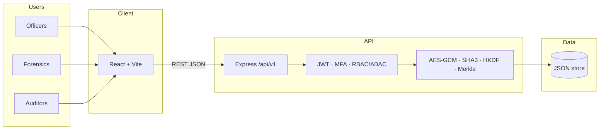
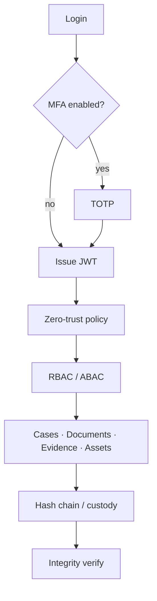

# CaseVault

<p align="center">
  
</p>

<p align="center">
  <a href="https://github.com/gnanadeep30805/CaseVault"></a>
  
  
  
</p>

**Secure digital case, evidence, and police-asset management** for investigation teams. CaseVault is a working React + Express prototype: officers can sign in, manage cases, verify document and evidence integrity, follow chain of custody, and audit every sensitive action.

> Built for law-enforcement / legal workflows. Security checks run on the **server**, not only in the UI.

---

## Live demo (local)

After you start the app (steps below), open:

| Surface | URL |
| --- | --- |
| **Web app** | [http://localhost:5173](http://localhost:5173) |
| **API health** | [http://localhost:4000/health](http://localhost:4000/health) |
| **API base** | `http://localhost:4000/api/v1` |

### Demo accounts

Password for all seeded users: `password123`

| Role | Email | Username | MFA |
| --- | --- | --- | --- |
| **Supervisor (fastest demo)** | `supervisor@casevault.local` | `supervisor` | Off |
| Administrator | `admin@casevault.local` | `admin` | TOTP required |
| Investigation Officer | `investigator@casevault.local` | `investigator` | TOTP required |

Local TOTP secret (when MFA is enabled): `JBSWY3DPEHPK3PXP`  
Add it in any authenticator app (Google Authenticator, Authy, 1Password).

---

## Why CaseVault

Typical document tools store files and hope nobody tampers with them. CaseVault treats **integrity as a first-class feature**:

```text
Login → JWT / MFA → role + policy checks → action
     → hash / encrypt → custody or audit event → verify anytime
```

| You can | How it shows up |
| --- | --- |
| Authenticate securely | JWT access + refresh tokens, optional TOTP MFA |
| Run investigations | Cases, members, status, classification |
| Protect records | Document metadata, SHA3-256 verification, AES-256-GCM helpers |
| Track physical/digital proof | Evidence register + custody hash chain |
| Manage department kit | Asset lifecycle (assign, maintain, retire) |
| Prove what happened | Tamper-evident audit log + Merkle checks |
| See security posture | Security dashboard and verification screens |

---

## Architecture





**Today’s data layer** is a seeded JSON store (`backend/data/`, gitignored) so the prototype runs without Docker. Env hooks exist for PostgreSQL, Redis, and MinIO when you move to production-style infrastructure.

---

## Tech stack (what this repo actually uses)

| Layer | Technology |
| --- | --- |
| Frontend | React 18, Vite, React Router, Axios, Lucide, Recharts, Tailwind |
| Backend | Node.js, Express, Helmet, CORS, rate limiting, Zod, Pino |
| Auth | JWT (HS256), bcrypt, `otplib` TOTP |
| Crypto | AES-256-GCM, SHA3-256, HKDF-style derivation, Merkle tree, hash chains |
| Tests | Node.js built-in test runner |

JavaScript only (`.js` / `.jsx`). No TypeScript in application source.

---

## Quick start

**Prerequisites:** Node.js LTS and npm.

```bash
git clone https://github.com/gnanadeep30805/CaseVault.git
cd CaseVault
```

**Backend**

```bash
cd backend
npm install
npm start
```

API listens on **port 4000**.

**Frontend** (new terminal)

```bash
cd frontend
npm install
npm run dev
```

App listens on **port 5173**.

Optional: copy `.env.example` to `backend/.env` and set secrets. Defaults work for local development.

### Tests

```bash
cd backend
npm test -- --test-reporter=spec
```

---

## Application map

| Route | Purpose |
| --- | --- |
| `/login` | Sign in |
| `/verify-mfa` | TOTP step |
| `/` | Dashboard |
| `/cases` · `/cases/:id` | Case list and detail |
| `/documents` · `/documents/:id/integrity` | Documents and hash verify |
| `/evidence` · `/evidence/:id/integrity` | Evidence and custody verify |
| `/assets` | Asset register |
| `/audit` · `/audit/integrity` | Audit trail and chain check |
| `/security` · `/verification` | Security overview and proofs |
| `/settings` · `/profile` | Preferences and user profile |

---

## API surface

All routes are under `/api/v1`.

| Group | Examples |
| --- | --- |
| Auth | `POST /auth/login` · `POST /auth/verify-mfa` · `POST /auth/refresh` · `POST /auth/logout` · `GET /auth/me` |
| Cases | `GET/POST /cases` · `GET /cases/:id` |
| Documents | Upload, list, integrity verify |
| Evidence | Register, transfer custody, verify |
| Assets | CRUD-style lifecycle operations |
| Audit | Event list, chain verify |
| Security | Overview, alerts, policy evaluation |
| Health | `GET /health` (no `/api` prefix) |

Success responses use `{ success: true, data }` with a request id from middleware.

---

## Repository layout

```text
CaseVault/
├── frontend/          # React SPA (Vite)
│   └── src/pages/     # Dashboard, cases, evidence, audit, security…
├── backend/
│   ├── src/routes/    # REST modules
│   ├── src/services/  # Auth, store, security-core
│   └── src/middleware/
├── docs/              # Architecture, crypto, authorization, evidence chain
├── .env.example
└── README.md
```

---

## Implemented vs later

**In this prototype**

- JWT login, MFA gate, protected APIs  
- Cases, documents, evidence, assets, audit UI + APIs  
- AES-256-GCM, SHA3-256, HKDF, Merkle, custody/audit hash chains  
- Zero-trust style policy evaluation on the server  
- Security and verification screens  

**Documented for later (not claimed as running services)**

OpenSearch, OCR workers, RabbitMQ, RAG assistant, Hyperledger Fabric, production KMS/HSM, Grafana/Prometheus.

That split is intentional: a few **working** security mechanisms beat a long list of unused names.

---

## Documentation

| Doc | Topic |
| --- | --- |
| [docs/architecture.md](docs/architecture.md) | System shape |
| [docs/security.md](docs/security.md) | AuthZ and integrity |
| [docs/cryptography.md](docs/cryptography.md) | Primitives |
| [docs/authorization.md](docs/authorization.md) | RBAC / ABAC |
| [docs/evidence-chain.md](docs/evidence-chain.md) | Custody flow |

---

## Security notes

- Do not commit `.env`, JWT secrets, or production keys.  
- Frontend checks are UX only; the API enforces access.  
- Default passwords and MFA secrets are **development only**.  
- Synthetic test datasets stay out of Git (see `.gitignore`).

---

<p align="center">
  <strong>CaseVault</strong> — cases, evidence, assets, and cryptographic integrity in one place.
</p>
