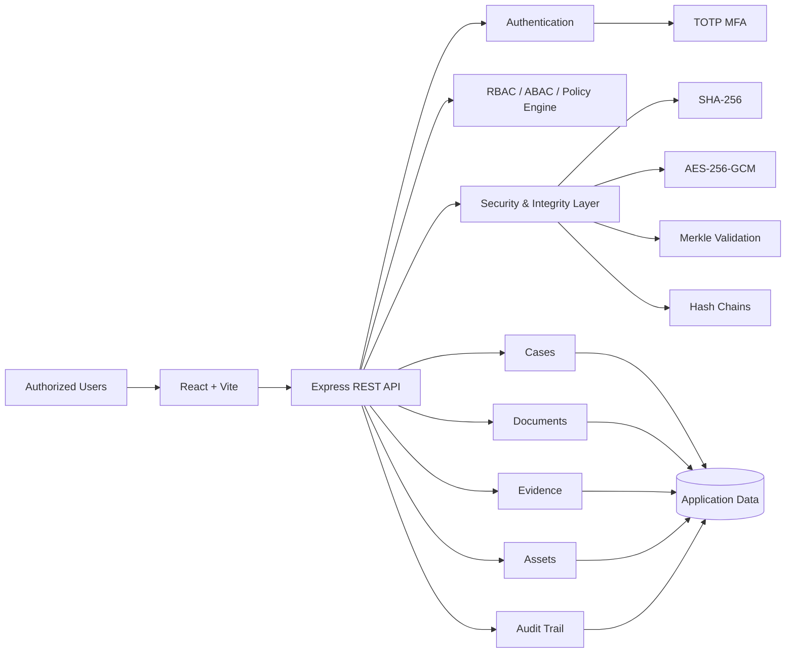
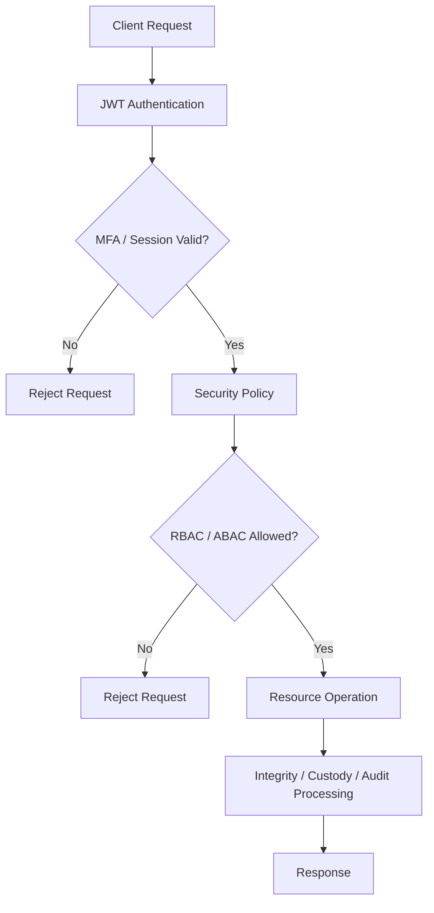

# CaseVault

<div align="center">

**Secure Case, Evidence & Asset Management with Cryptographic Integrity**

A security-first web platform for managing investigation cases, documents, evidence, department assets, and audit records — with server-side authorization, multi-factor authentication, tamper-evident chains, and cryptographic integrity verification.

[](https://react.dev/)
[](https://vite.dev/)
[](https://nodejs.org/)
[](https://expressjs.com/)
[](https://jwt.io/)
[](#security-model)

</div>

---

## Overview

Investigation teams work with sensitive records where **confidentiality, controlled access, traceability, and integrity** are critical.

Traditional file-management systems can store documents, but storage alone does not answer important questions:

- Who is allowed to access a case?
- Has an evidence record been changed?
- Who transferred custody of an item?
- Can an audit trail be trusted?
- Can the system verify that a document is still the same document?
- Can sensitive operations be traced back to a specific action?

**CaseVault addresses these requirements by combining case management with security and integrity controls.**

The platform provides a centralized workflow for:

**Cases → Documents → Evidence → Chain of Custody → Assets → Audit Logs → Integrity Verification**

> CaseVault is a working development prototype. It demonstrates the security architecture and implemented mechanisms described below; production deployments would require hardened infrastructure, managed key storage, persistent production databases, and operational controls.

---

## The Problem

Sensitive investigation data is often distributed across documents, spreadsheets, file systems, and separate tracking processes.

This creates several risks:

1. **Unauthorized access** — users may access information outside their role or clearance.
2. **Record tampering** — changes to documents or evidence records may be difficult to detect.
3. **Broken chain of custody** — evidence movement needs a verifiable history.
4. **Weak auditability** — sensitive actions need an immutable or tamper-evident trail.
5. **Fragmented asset management** — department equipment needs lifecycle tracking.
6. **Client-side-only security** — hiding a UI button is not sufficient authorization.

CaseVault approaches these problems from the backend first: **authentication, authorization, integrity verification, and audit controls are enforced by the API rather than trusted solely to the frontend.**

---

## The Solution

CaseVault provides a single security-focused platform where authorized users can manage investigation data while the backend continuously applies access and integrity controls.

### Core workflow

```text
User
  ↓
Authentication
  ↓
TOTP MFA (when enabled)
  ↓
JWT access
  ↓
Server-side security policy
  ↓
RBAC / ABAC checks
  ↓
Case / Document / Evidence / Asset operation
  ↓
Integrity + audit processing
  ↓
Verified result
```

### What the platform provides

| Capability | Solution |
|---|---|
| Authentication | JWT-based authentication with optional TOTP MFA |
| Authorization | Server-side role and policy checks |
| Case management | Create, view, classify, and manage investigation cases |
| Document protection | Document metadata and cryptographic integrity verification |
| Evidence management | Evidence registration and custody transfers |
| Chain of custody | Hash-linked custody history |
| Asset management | Track department assets through their lifecycle |
| Auditability | Security-sensitive actions recorded in an audit chain |
| Integrity verification | SHA-256, hash chains, and Merkle validation |
| Data protection | AES-256-GCM encryption helpers |
| Security visibility | Security and verification dashboards |

---

## Key Features

### Authentication & MFA

CaseVault uses a multi-step authentication flow:

```text
Login
  ↓
Credentials validated
  ↓
MFA enabled?
  ├── No  → JWT issued
  └── Yes → TOTP verification → JWT issued
```

Implemented components include:

- JWT bearer authentication
- Password hashing
- TOTP-based MFA flow
- Token refresh/logout flow
- Protected API routes
- Authentication middleware

---

### Server-Side Authorization

CaseVault does not rely on frontend route protection alone.

Every protected API operation is evaluated on the server.

The authorization model combines:

- Authentication state
- User role
- Department
- Clearance
- MFA state
- Device trust
- Request risk
- Resource/action being requested

Conceptually:

```text
Request
  ↓
Authenticated?
  ↓
Role allowed?
  ↓
Policy satisfied?
  ↓
Resource access allowed?
  ↓
Execute operation
```

This creates a **zero-trust-style authorization flow** where each sensitive request is evaluated instead of assuming that an authenticated user can access everything.

---

### Cryptographic Integrity

CaseVault treats data integrity as a first-class feature.

Implemented cryptographic mechanisms include:

- **AES-256-GCM** for authenticated encryption
- **SHA-256** for hashing
- **HKDF-style key derivation helper**
- **Hash chains**
- **Merkle tree generation**
- **Merkle proof verification**
- **Custody-chain validation**
- **Audit-chain validation**

The goal is not simply to store a record, but to provide a mechanism for detecting unexpected modification.

---

### Evidence & Chain of Custody

Evidence records can move between authorized users or stages of an investigation.

Each custody event can reference the previous state through cryptographic hashes:

```text
Evidence Created
      ↓
Custody Event 1
      ↓
Custody Event 2
      ↓
Custody Event 3
      ↓
Current Evidence State
```

Conceptually:

```text
currentHash = H(previousHash + eventData)
```

If historical data is modified, the hash relationship can no longer validate correctly.

CaseVault exposes this verification through the backend and the application UI.

---

### Tamper-Evident Audit Trail

Security-sensitive operations are represented in an audit chain.

Instead of treating logs as ordinary text records, CaseVault maintains relationships between audit events so that the sequence can be verified.

```text
Event A
  ↓ hash
Event B
  ↓ hash
Event C
  ↓ hash
Event D
```

The verification layer can detect inconsistencies in the expected chain.

> This provides tamper-evident integrity; it should not be described as mathematically immutable storage without additional infrastructure controls.

---

### Case Management

Cases provide the central organizational unit for investigations.

The application supports workflows around:

- Case listing
- Case details
- Case status
- Classification
- Case members
- Associated documents
- Associated evidence
- Investigation-related records

---

### Document Management

Documents are associated with investigation workflows and can be checked for integrity.

The platform provides:

- Document records
- Document metadata
- Protected API access
- Integrity verification
- Security verification UI

The important distinction is that **document integrity can be verified independently of simply trusting the stored metadata.**

---

### Asset Management

CaseVault also manages department assets such as operational equipment:
vehicles, bikes, laptops, cameras, radios, drones, GPS units and forensic
equipment. The full lifecycle is:

```text
Purchase
   ↓
Register
   ↓
Assign to Officer/Station
   ↓
Use
   ↓
Maintenance
   ↓
Transfer
   ↓
Retire/Dispose
```

Each transition is validated against a state machine, so illegal jumps are
rejected, and status changes require a reason. For example, vehicle `V102`:

| Field | Value |
| --- | --- |
| Purchased | 2025 (vendor, cost, warranty) |
| Assigned | Police Station A, Officer Ravi |
| Maintenance | August 2026 |
| Transferred | Police Station B |
| Status | Active / In Use |

Every step writes both an `assetHistory` entry and an audit event, so a single
asset can be reconstructed end to end. This provides a single place to track
operational assets alongside investigation workflows.

---

## Architecture



### Security request flow



---

## Technology Stack

| Layer | Technology |
|---|---|
| Frontend | React 18, Vite, React Router |
| State | React Context providers (auth, theme, toast) |
| UI | Tailwind CSS, Lucide React, clsx |
| Data visualization | Recharts |
| HTTP client | Axios, with automatic token refresh |
| Backend | Node.js, Express |
| Security middleware | Helmet, CORS, rate limiting |
| Authentication | JWT access tokens + revocable refresh sessions |
| Password security | bcrypt |
| MFA | otplib / TOTP |
| Encryption | AES-256-GCM |
| Hashing | SHA-256, HMAC-SHA-256 |
| Integrity | Hash chains, Merkle trees |
| Logging | Pino |
| Persistence | JSON metadata store + encrypted `.cvault` files |
| Testing | Node.js built-in test runner, plus an API smoke suite |
| Language | JavaScript / JSX |

---

## Project Structure

```text
CaseVault/
│
├── frontend/
│   ├── src/
│   │   ├── pages/          one module per screen
│   │   ├── components/     layout, ui, charts, ai
│   │   ├── context/        auth, theme, toast providers
│   │   ├── hooks/          useResource, useDocumentTitle, helpers
│   │   └── lib/            apiClient, capabilities, format, csv, secureFiles
│   ├── package.json
│   └── vite.config.js
│
├── backend/
│   ├── src/
│   │   ├── routes/         one router per resource group
│   │   ├── services/       store, auth, ai, security-core, storage
│   │   ├── middleware/     auth, error handling
│   │   ├── config/         env, logger
│   │   └── server.js
│   ├── scripts/            api-smoke.mjs
│   ├── package.json
│   └── data/               runtime JSON store and encrypted documents (gitignored)
│
├── docs/
│   ├── architecture.md
│   ├── security.md
│   ├── cryptography.md
│   ├── authorization.md
│   └── evidence-chain.md
│
├── .env.example
├── .gitignore
└── README.md
```

---

## Application Modules

| Module | Purpose |
|---|---|
| Dashboard | Security and operational overview |
| Cases | Investigation case management, members, timeline and tasks |
| Documents | Uploads, versions, approval, sharing, signatures and integrity |
| Evidence | Evidence registration, custody transfers and chain validation |
| Tasks | Assigned work with status transitions and due dates |
| Search | Cross-resource search filtered to what the caller may read |
| Assistant | Authorization-filtered AI workspace and case assistant |
| Reports | Summary, cases, documents, evidence, tasks and integrity reports |
| Audit | Audit events with hash-chain verification |
| Security | Security posture, alerts and events |
| Users | Role, department, clearance and status administration |
| Departments | Department directory and case distribution |
| Assets | Department asset lifecycle with assignment and maintenance |
| Profile | Display name, password change and effective permissions |
| Settings | Theme, session and enforced-policy information |

---

## API

The backend exposes REST APIs under:

```text
/api/v1
```

Every response is wrapped as `{ "success": boolean, "data": ... }`, and errors
as `{ "success": false, "error": { "code": string, "message": string } }`.

### Authentication

```http
POST /api/v1/auth/register
POST /api/v1/auth/login
POST /api/v1/auth/verify-mfa
POST /api/v1/auth/demo-code          (development only)
POST /api/v1/auth/refresh
POST /api/v1/auth/logout
GET  /api/v1/auth/me
GET  /api/v1/auth/mfa/setup
POST /api/v1/auth/forgot-password
POST /api/v1/auth/reset-password
POST /api/v1/auth/change-password
```

### Cases

```http
GET    /api/v1/cases
POST   /api/v1/cases
GET    /api/v1/cases/:id
PATCH  /api/v1/cases/:id
PATCH  /api/v1/cases/:id/status
GET    /api/v1/cases/:id/documents
GET    /api/v1/cases/:id/evidence
GET    /api/v1/cases/:id/members
POST   /api/v1/cases/:id/members
DELETE /api/v1/cases/:id/members/:userId
GET    /api/v1/cases/:id/timeline
POST   /api/v1/cases/:id/timeline
```

### Other API groups

```text
Documents   /documents  /documents/shared  versions, shares, signatures, verify
Evidence    /evidence   custody, transfer, verify, verify-custody
Tasks       /tasks      /tasks/case/:caseId
Signatures  /signatures /signatures/requests
Users       /users      /users/me  /users/departments  /users/roles
Notifications /notifications  /notifications/unread-count
Search      /search?q=
Dashboard   /dashboard  /dashboard/summary  /dashboard/recent-activity
AI          /ai/info  /ai/workspace  /ai/analyze  /ai/cases/:caseId/chat
            /ai/cases/:caseId/summarize  /ai/documents/:id/analyze
Reports     /reports/:type   (summary, cases, documents, evidence, tasks, integrity)
Audit       /audit  /audit/actions  /audit/export  /audit/verify-chain
Security    /security/overview  /security/alerts  /security/events
            /security/audit/verify-chain  /security/integrity/hash-chain
Assets      /assets  assign, transfer, return, status, maintenance, history
```

### Asset lifecycle

Assets follow an enforced state machine, and every transition requires a
reason and is written to the audit trail and to the asset's own history:

```
Purchased -> Registered -> Assigned -> In use -> Maintenance -> Retired -> Disposed
                       \-> Transferred (station/department handover)
```

| Step | Endpoint |
| --- | --- |
| Purchase + register | `POST /assets` (accepts `purchaseDate`, `vendor`, `purchaseCost`, `warrantyExpiry`) |
| Assign to officer/station | `PATCH /assets/:id/assign` |
| Transfer to another station | `PATCH /assets/:id/transfer` (department, location, reason) |
| Return | `PATCH /assets/:id/return` |
| Schedule maintenance | `POST /assets/:id/maintenance` |
| Complete maintenance | `PATCH /assets/:id/maintenance/complete` |
| Retire / dispose | `PATCH /assets/:id/status` with a reason |
| Inspect | `GET /assets/:id/history`, `GET /assets/:id/maintenance` |

Illegal transitions are rejected with `409` and each step emits an audit
event (`ASSET_PURCHASED`, `ASSET_REGISTERED`, `ASSET_ASSIGNED`,
`ASSET_TRANSFERRED`, `ASSET_RETURNED`, `ASSET_STATUS_CHANGED`,
`ASSET_MAINTENANCE_SCHEDULED`, `ASSET_MAINTENANCE_COMPLETED`).

Health check:

```http
GET /health
```

A successful API response follows the project's standard response structure:

```json
{
  "success": true,
  "data": {}
}
```

---

## Getting Started

### Prerequisites

Install:

- Node.js LTS
- npm
- Git

### 1. Clone the repository

```bash
git clone https://github.com/gnanadeep30805/CaseVault.git
cd CaseVault
```

### 2. Configure environment variables

Copy the example environment file:

```bash
cp .env.example backend/.env
```

On Windows PowerShell:

```powershell
Copy-Item .env.example backend/.env
```

Review the values in `backend/.env` before running the application.

> **`.env` is optional.** Every value in `backend/src/config/env.js` has a
> development fallback, so the stack runs with no `.env` at all. Copying the
> example is only needed to change ports, secrets, SMTP, or upload limits.

#### Native dependencies

`bcrypt` and `esbuild` require install scripts to fetch or build their
platform binary. npm 11 and later block install scripts by default, so both
packages declare an `allowScripts` entry in their `package.json`:

```json
"allowScripts": { "bcrypt": true }
```

This is what allows `npm install` to run them without a warning. If you ever
see this on install, the script is not covered yet:

```text
npm warn allow-scripts  1 package has install scripts not yet covered by allowScripts
```

Approve it from the affected package directory:

```bash
cd backend   && npm approve-scripts --no-allow-scripts-pin bcrypt
cd frontend  && npm approve-scripts --no-allow-scripts-pin esbuild
```

Use `--no-allow-scripts-pin` so the entry tracks the package name rather than
`name@version`; a pinned entry silently stops matching after a version bump.
A blocked script usually surfaces later as a native-module error such as
`Could not locate the bindings file`, or as a Vite build that fails on a
missing esbuild binary.

### 3. Start the backend

```bash
cd backend
npm install
npm start
```

The API runs on:

```text
http://localhost:4000
```

### 4. Start the frontend

Open another terminal:

```bash
cd frontend
npm install
npm run dev
```

The development application is available at:

```text
http://localhost:5173
```

### 5. Sign in

The API seeds seven demo accounts. Every one of them uses the password
`password123`, which is the bcrypt hash in `DEV_PASSWORD_HASH`.

| Email | Role | Clearance | MFA |
| --- | --- | --- | --- |
| `admin@casevault.local` | Administrator | HIGHLY_RESTRICTED | Required |
| `investigator@casevault.local` | Investigation Officer | CONFIDENTIAL | Required |
| `supervisor@casevault.local` | Supervisor | RESTRICTED | Disabled |
| `legal@casevault.local` | Legal Officer | RESTRICTED | Required |
| `analyst@casevault.local` | Analyst | RESTRICTED | Disabled |
| `forensics@casevault.local` | Investigation Officer | CONFIDENTIAL | Disabled |
| `disabled@casevault.local` | Viewer | INTERNAL | Disabled (cannot sign in) |

Where MFA is required, the sign-in screen shows a **Get current test code**
button. It calls `POST /api/v1/auth/demo-code`, which is refused whenever
`ALLOW_DEMO_MFA=false` or `NODE_ENV=production`.

### 6. Run the tests

```bash
cd backend
npm test          # unit tests
npm run smoke     # end-to-end API and authorization suite
```

The smoke suite boots the API against a throwaway data directory in the
system temp folder, so it never touches `backend/data`. It raises the rate
limit for its own process and asserts both positive and negative paths,
including authorization denials, document and evidence integrity, the audit
hash chain, document sharing, and the full password-reset lifecycle.

---

## Local Development

| Service | Address |
|---|---|
| Web application | http://localhost:5173 |
| Backend API | http://localhost:4000 |
| API health | http://localhost:4000/health |
| API base | http://localhost:4000/api/v1 |

The current prototype is designed to run locally without requiring the full production infrastructure stack.

---

## Security Model

CaseVault follows four major security principles:

### 1. Authenticate every protected session

A user must authenticate before accessing protected resources.

### 2. Authorize on the server

Frontend checks improve user experience but are **not treated as security boundaries**.

The backend evaluates permissions before sensitive operations.

### 3. Verify integrity

Documents, evidence custody events, and audit events can be checked through cryptographic verification mechanisms.

### 4. Keep secrets away from the frontend

Cryptographic and authentication secrets belong in the backend environment and, in production, should be managed by dedicated secret/key-management infrastructure.

---

## Cryptographic Design

### Encryption

CaseVault includes AES-256-GCM support for authenticated encryption.

```text
Plaintext
   ↓
AES-256-GCM
   ↓
Ciphertext + Authentication Tag
```

A unique IV/nonce must be used for each encryption operation.

### Hashing

SHA-256 is used to produce deterministic integrity digests:

```text
Data
 ↓
SHA-256
 ↓
Digest
```

### Merkle validation

Multiple records can be represented in a Merkle tree:

```text
             Root
            /    \
          H12    H34
         /  \   /  \
       H1   H2 H3   H4
       │    │  │    │
      R1   R2 R3   R4
```

This allows the system to validate whether a record is consistent with a known Merkle root.

---

## Current Implementation vs Production Roadmap

CaseVault intentionally distinguishes between **implemented prototype functionality** and infrastructure that would be required for a production deployment.

### Implemented

- React 18 web application with a protected route tree, light/dark theming and a responsive shell
- Express REST API with Helmet, CORS, request ids and configurable rate limiting
- JWT access tokens with rotating, server-side revocable refresh sessions
- TOTP MFA flow, including enrolment and a development-only code endpoint
- Password reset and in-session password change, both of which revoke other refresh sessions
- Server-side RBAC plus per-resource clearance and case-membership authorization
- Cases, case members, status transitions and a case timeline
- Documents with immutable versions, MIME and size validation, approval workflow, per-user
  sharing with expiry and revocation, and signature requests
- Evidence with custody events, transfers and hash-linked custody-chain validation
- Tasks, notifications, global search and departments
- Asset register with an enforced lifecycle, assignment, maintenance and history
- Reports, audit browsing with chain verification, and a security console
- Authorization-filtered AI workspace, case chat, case summary and document analysis, with a
  deterministic local provider that makes no external network calls
- AES-256-GCM document encryption at rest, SHA-256 integrity hashing, HMAC signing and audit hash chains
- 19 unit tests and a 159-check end-to-end API smoke suite

### Not wired up

`DATABASE_URL`, `REDIS_URL` and the `MINIO_*` variables are still present in
`backend/src/config/env.js` for historical reasons but are **not read by any
application code**. Persistence is the JSON store plus encrypted files on disk.
SMTP delivery is supported when `SMTP_*` and the optional `nodemailer` package
are configured; otherwise outbound mail is written to the `mailOutbox`
collection in the data file.

### Production roadmap

The repository contains integration direction/hooks for infrastructure such as:

- PostgreSQL
- Redis
- MinIO
- Vault / KMS / HSM-backed key management
- OpenSearch
- OCR processing
- RabbitMQ
- RAG-based investigation assistant
- Hyperledger Fabric
- Prometheus / Grafana

These should be treated as **future production extensions unless explicitly implemented and deployed in the repository**.

---

## Why the Architecture Matters

The central design decision in CaseVault is to combine **business workflows with verifiable security controls**.

Instead of:

```text
Store → Trust
```

the platform aims for:

```text
Store
  ↓
Control access
  ↓
Record the operation
  ↓
Protect integrity
  ↓
Verify when required
```

This makes security an application workflow rather than a separate feature.

---

## Documentation

Detailed technical documentation is available in the repository:

- [Architecture](docs/architecture.md)
- [Security Model](docs/security.md)
- [Cryptography](docs/cryptography.md)
- [Authorization Model](docs/authorization.md)
- [Evidence Chain](docs/evidence-chain.md)

---

## Security Considerations

This project is intended for development, demonstration, learning, and prototyping.

For real deployment involving sensitive investigation or legal records, additional controls would be required, including:

- Production-grade identity management
- Hardware-backed or managed key storage
- Secure secret rotation
- Persistent production database configuration
- Object storage with appropriate access controls
- TLS everywhere
- Centralized monitoring and alerting
- Backup and disaster recovery
- Formal threat modeling
- Security testing and penetration testing
- Data-retention and compliance controls
- Stronger operational controls around privileged users

**Never use the demo credentials or development secrets in a production environment.**

---

## Contributing

Contributions are welcome.

A typical workflow:

```bash
git checkout -b feature/your-feature
git add .
git commit -m "feat: describe your change"
git push origin feature/your-feature
```

Then open a pull request with:

- What changed
- Why it changed
- How it was tested
- Any security implications

---

## License

No explicit open-source license is currently declared in the repository.

If you intend others to reuse or distribute CaseVault, add an appropriate license file before presenting it as an open-source project.

---

<div align="center">

**CaseVault**

*Secure cases. Traceable evidence. Verifiable integrity.*

</div>
